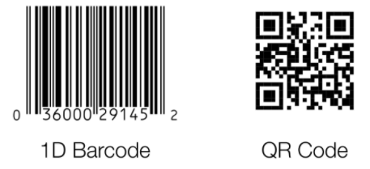
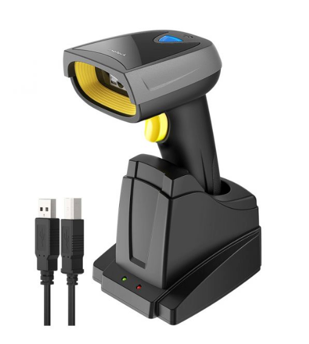

# Equipment Barcoding

Barcodes help you manage your equipment cache. A barcode is a quick way for a computer to identify visually which item it is looking at. Each barcode represents a string of characters or digits. When a barcode is scanned, D4H searches for a matching value in the Barcode or Ref fields. The Ref field is searched as well because many people use the number on the barcode sticker as their Ref.  
  
Barcode types available to use are Code128, QR or ITF. To change the type:

* Go to  Settings
* Select **Equipment Settings** under **Equipment**
* Under Settings you can select the barcode type from the drop down \(We would recommend using QR codes if you would like to scan with a camera\). 

## What Hardware Do I Need?

  
You can buy pre-made barcode or QR stickers codes from [https://www.myassettag.com](https://www.myassettag.com/). You can buy them to match your Refs or just get random digits on them. Please make sure if you are selecting random that they do not match any of your existing Refs e.g. start from a high number such as 5000001, 5000002, 5000003 etc.  
  
For scanning you have two options. You can either use the camera on your smartphone and our Equipment Management mobile app, or you can use a USB barcode scanner attached to your laptop/desktop computer.  
  
A USB scanner is recognized by your computer as a keyboard, and it types the barcode wherever the cursor is and presses enter. If you would like to use a USB barcode scanner with our web version on desktop, we recommend the [Inateck BCST-52](https://www.inateck.com/inateck-2d-wireless-barcode-scanner-qr-code-scanner-with-smart-base-read-screen-bcst-52-black.html).  



