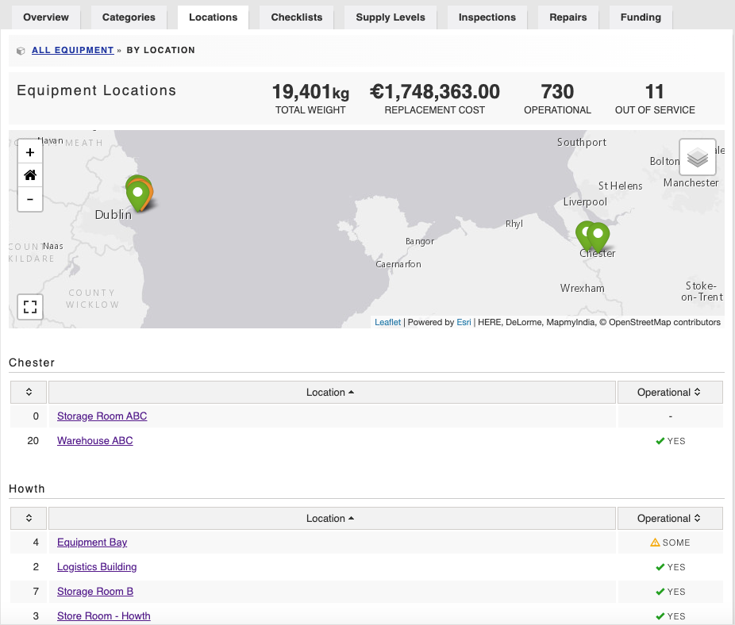

# Equipment Locations

Equipment locations help you isolate your equipment cache into specific storage locations. They should be permanent, non-movable locations such as a warehouse or vehicle bay; not gear bags or vehicles.  
  
Permissioned members can filter equipment by location and create printable lists of equipment on a per-site basis.  





