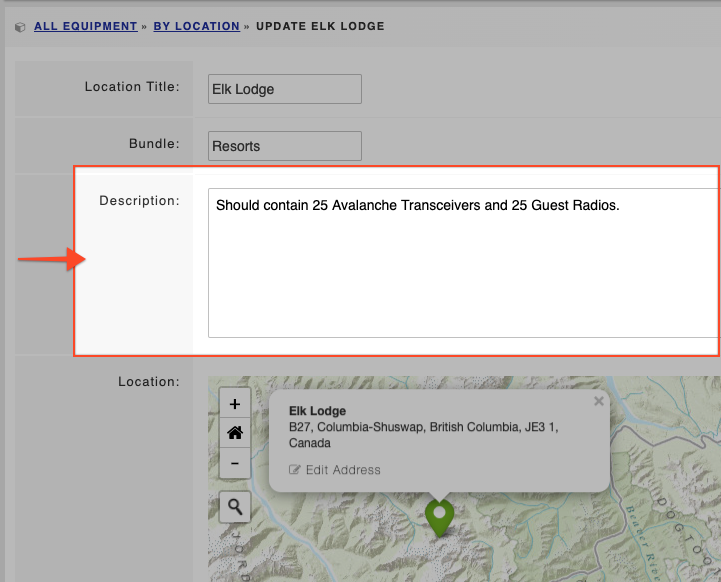

# Creating an Equipment Location

To create a location to store your equipment:

* Navigate to the Locations tab
* Click **Add Location**
* Give your location a title such as Storage Room A / Vehicle Bay / Training Building / Warehouse D
* The bundle field allows you to group storage areas together, see the examples listed below 

|  **Bundle**  |  **Locations in that bundle**  |
| :--- | :--- |
|  Warehouses  |  Warehouse A  |
|  |  Warehouse B  |
|  Stations  |  Station 1  |
|  |  Station 2  |
|  Building A  |  Locker Room  |
|  |  Storage Room A  |
|  |  Storage Room B   |
|  |  Vehicle Bay  |

* You can add a 'Description' to your equipment, such as notes, requirements, project details, or deployment contact details 

* Click **Select On Map** if you want to pin the equipment location to the map
* Click **Save Changes**



\*\*\*\*

  

