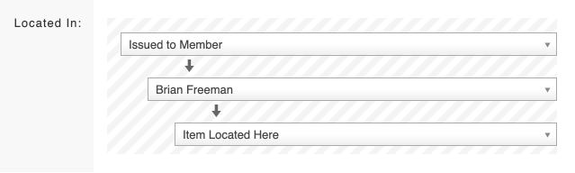

# Issuing equipment to a team member

To issue an item of equipment to a team member go to the specific item of equipment:

* Click **Update Details** on the item of equipment
* Under the **Located In** section click on **Update Location**
* Click on the drop down and scroll to the bottom, select **Issued to Member**
* Click on the next drop down and a list of your members will appear, you can scroll through the list or start typing their name in the search box
* Select the member you want to issue the item to
* Click **Save Changes** at the bottom of the page

The above instructions can also be used to move equipment to a new [location](./). Instead of selecting **Issued to Member**, simply choose the location you want to move the item to.   
  
You will see below that if there are sub-locations available to move the item to, then additional drop down boxes will appear. This allows you to drill down to the exact location of the item.

The above instructions go through how to move a single item of equipment. It is also possible to [bulk move equipment](bulk-moving-items-of-equipment.md). 

