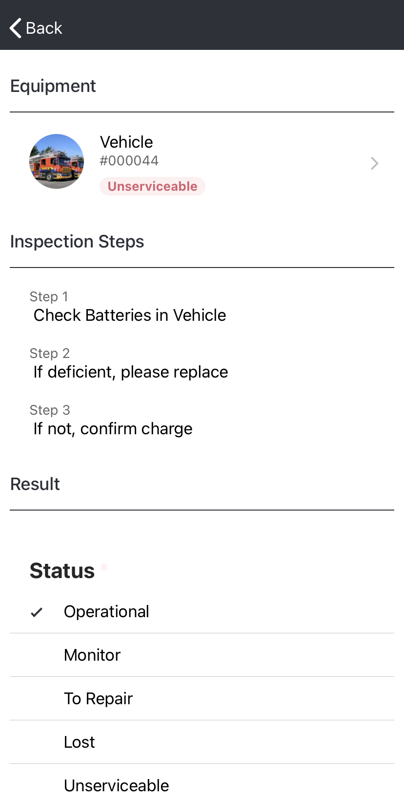

# Completing an Inspection in the App

To complete an inspection in the[ D4H Equipment Management](../getting-started.md) app:

* Open the app
* Click the white  in the upper left hand corner of the main screen
* Select **Inspections**
* Chose an inspection to complete
* Follow the steps listed under Inspection Steps 
* Chose a result of the inspection from under **Status**
* Click **Submit**

\*\*\*\*

