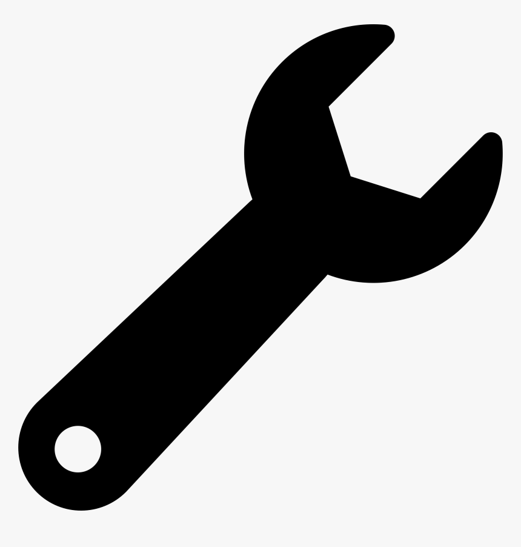

# Equipment Settings

To find additional equipment settings navigate to   Settings and scroll down to the Equipment section.

Here you can turn on or off certain modules within Equipment Management:\

\
**Auto-Out of Service:** If this is set to On and an item of equipment expires, the item will automatically change status to be out of service\
\
**Show in Lists:** tick the boxes if you want this information displayed in the list view

\
\
**Barcode Type:** here you can select the [barcode](equipment-barcoding/) type you wish to use\
\
**Labels:** You can change the labels that appear in your account\
\

Categories & Kinds, Manufacturers, and Suppliers\

You can configure and edit your [categories & kinds](categories\&kinds/), [manufacturers](manufacturers-and-models/), and suppliers.&#x20;

## Retired Reasons

Here you can add in retired reasons for your equipment such as 'Failed Inspection'.&#x20;
