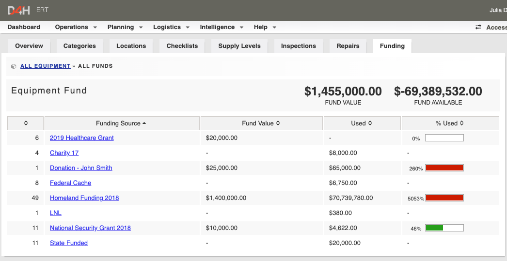

# Funding Sources

Funding sources allow you to add a fund value and track it until 100% is allocated. This will help you manage grants and donations by linking items of equipment to a specific funding source. It will also allow for greater tracking of what equipment was bought when a renewal or audit occurs.







