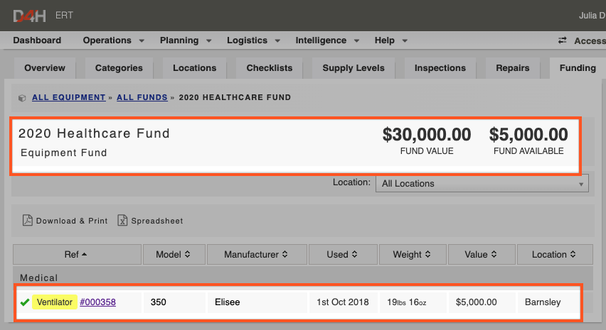

# Linking an item to a Funding Source

To link an item to a funding source:

* Go to the item of equipment
* Click **Update Details**
* In the 'Funding Source' drop down field, select the relevant fund
* Click **Save Changes** at the bottom of the screen 

* Now when you go back to the Funding section and open that funding source, you will see the item of equipment listed there. Any other items of equipment linked to this funding source will appear here as well  

