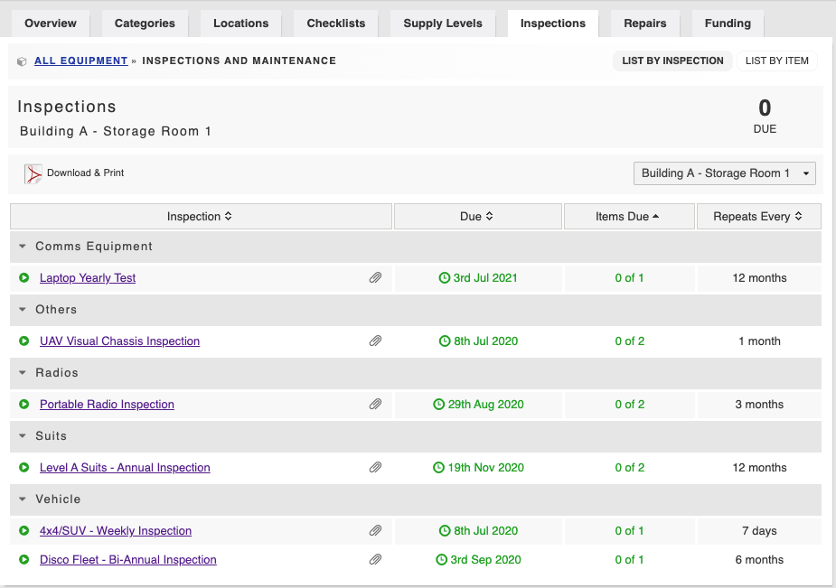

# Inspections

Inspections allow you to create regular recurring audits, maintenance, and checks on your equipment. Notifications are flagged on your dashboard and alerts emailed to maintenance personnel when an item of equipment is due to be inspected. 





