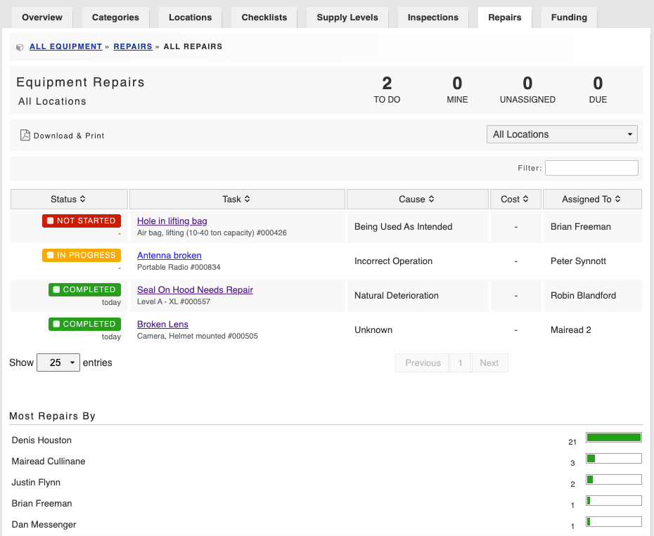

# Repairs

In the Repairs section, maintenance of [equipment](https://support.d4h.org/d4h-equipment-management/equipment-management) items can be identified and actions required documented and assigned to individuals. Repairs will be flagged on the assignee's dashboard and they will receive a [notification](https://support.d4h.org/d4h-equipment-management/equipment-alerts) by email.









