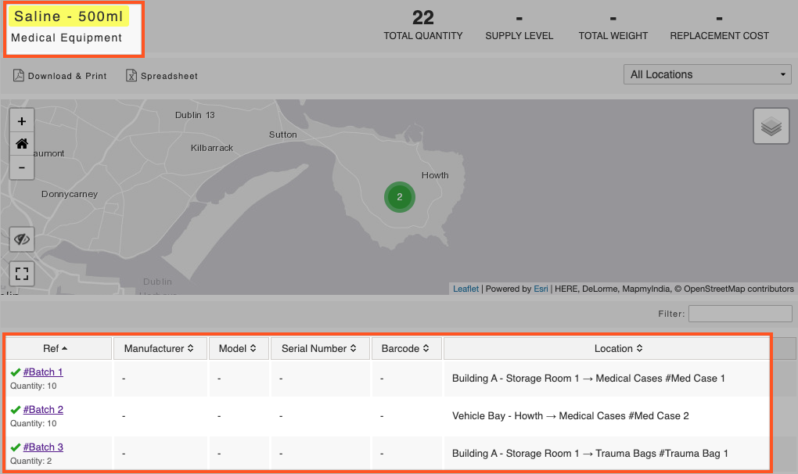

# Creating a Batch

You can create a batch of items with a quantity set against it if you want to record consumable equipment such as medical supplies. You could create a batch for Drug 'A' for example.


**Example:** To create a batch of items navigate to the category 'Medical Equipment' and then the kind Drug 'A'. Bearing in mind that the [kind](../) should be set as type 'supply'. This would have been specified when the kind was initially created. 


To create a batch:

* Click **Add Item**
* You can edit the reference field and put in 'Batch 1' / 'Batch 2' etc.
* Click **Create Item**
* Enter the quantity of that batch in the quantity field
* Click **Save** at the bottom of the page


If you need to disseminate Drug 'A' to more than one location, you must create a batch for each location.

I.e. 10 ampoules of Drug 'A' are stored in 10 different first aid kits which are all in different locations. You would need to create 10 items \(batches\) of Drug 'A' and give a quantity of 1 to each batch. These can then be allocated to the different first aid kits in their respective locations by updating the location on each item \(batch\). 


You will see in the screenshot below, there is an item for each batch that exists in a medical case or trauma bag. 

  
  

