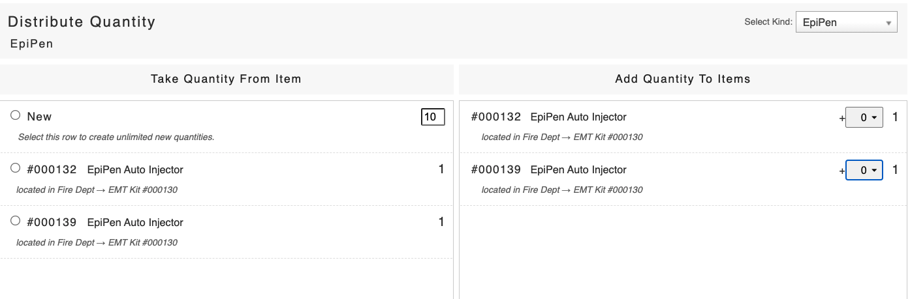

# Distribute Quantities

To distribute quantities of a supply to another item:

* Click **Distribute Quantities**
* Select the supply from the Select Kind drop down menu
* Select the supply in the box on the left hand side of the screen that you want to take from
* In the box on the right hand side, find the item you want to add the quantity to and click on the drop down
* Select the number from the drop down to add that quantity to that item
* You will now see the quantity of that item increase and the quantity will decrease from the supply on the left hand side
* Click **Distribute Quantities**

\*\*\*\*

