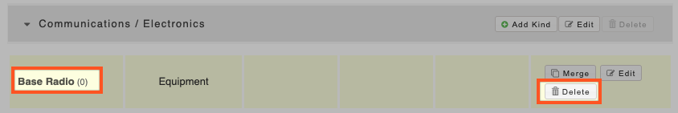

# Deleting kinds of equipment

To delete a kind of equipment:

* Navigate to the kind you wish to delete
* Click **Update Details**
* You will be brought to the Team Settings page for Categories & Kind


You cannot delete a kind of equipment if you have active equipment items in it, this is to prevent accidental mass deletion. To delete a kind with items in it, you must first delete each item of equipment. There is no bulk delete function for this.


* Once you have deleted all items in the kind you will now be able to delete the kind itself
* You will see in the example below that the kind 'Base Radio' has 0 items in it, therefore the **Delete** option is available to choose 

