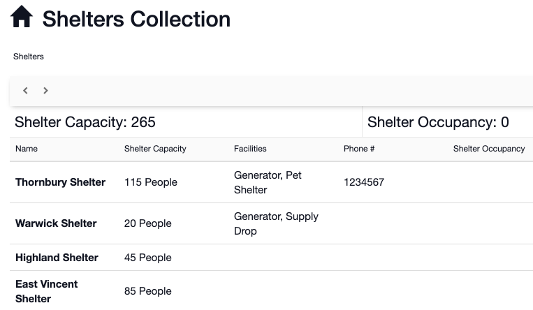

# Collections

#### WEB APP

Collections are designed to allow you to store content to be re-used again & again in any [Channel](../../channels/). Collection data can be created in advance for any [Form](./), [Roles](../../roles/), [Status Boards](../../status-boards/), or [Task Boards](../../task-boards/).


**Example:** You might decide to pre-load all of your information about your personnel, roads, buildings, fleet, rivers, shelters, etc. before an incident occurs. This will make it easy to retrieve during the event.










