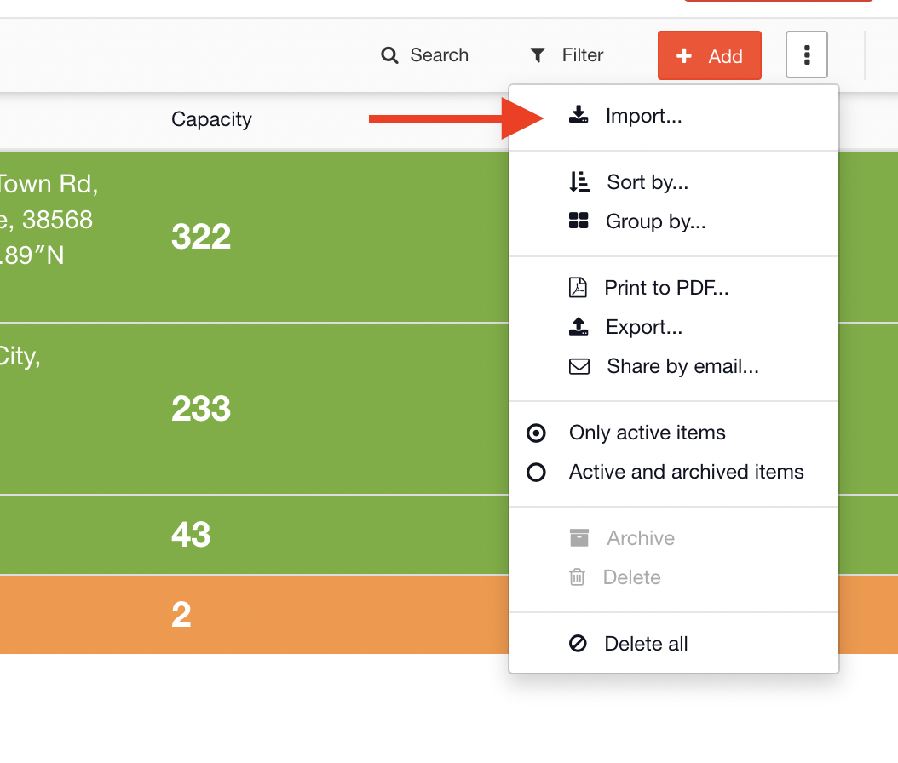
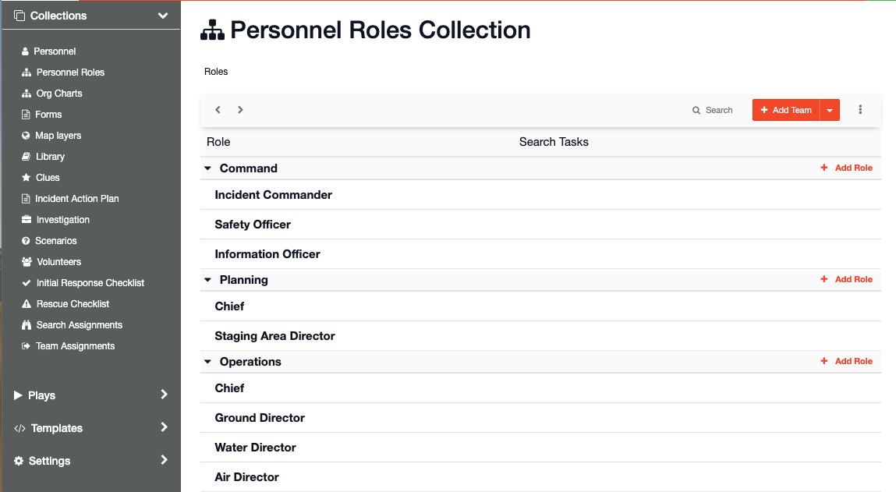
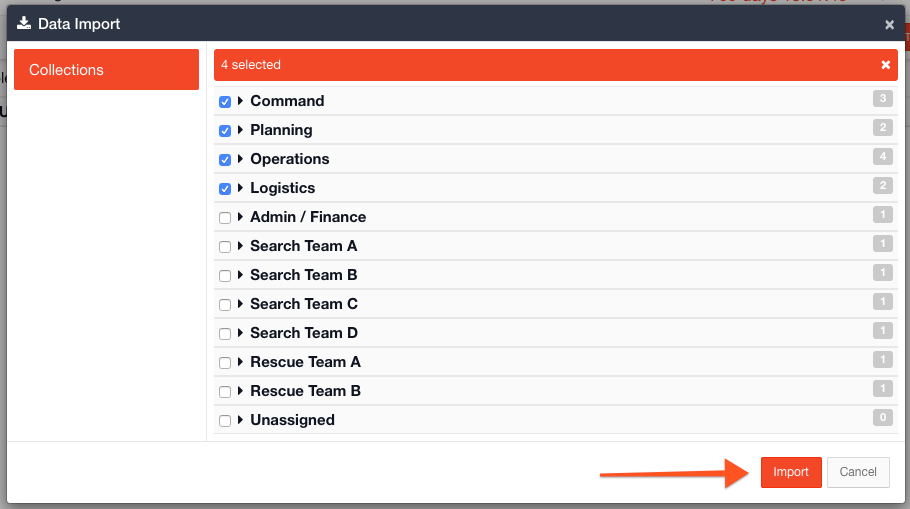
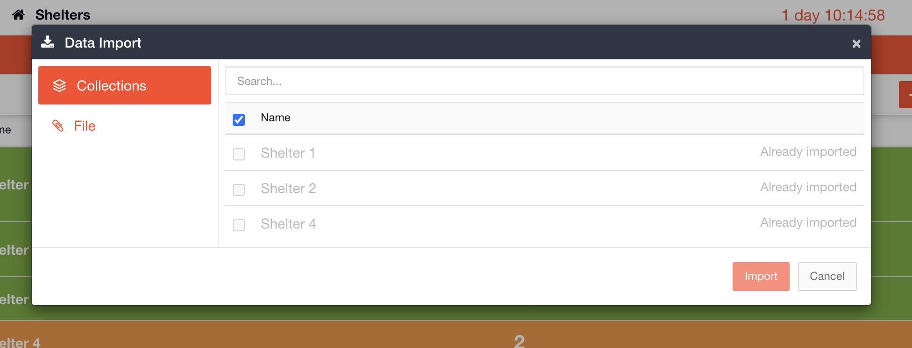

# Importing Collections into a Channel

#### WEB APP

Within [Incident Management](../../getting-started.md), it is possible to create and store pre-loaded content in [collections](./). Once you have created your collections in the [Admin Area](../), they become available to use within a [channel](../../channels/).   
  
When you go to your open channel and go to a module you have pre-loaded with data, click on the **⋮** symbol next to the add button and select import.

Your collection data will now be available to import into your channel.

Here is an example within the [Roles](../../roles/) module.

Teams and their respective roles are pre-loaded into the Admin Area:

Back in your open channel you can now import the teams and roles 

Once data has been imported from a collection, there will be a message displayed saying Already Imported the next time you click on import. 

You can also quickly import items from collections by clicking the add button. To set up this option, select **Suggest from collection** when creating the Status Board in the Admin Area.

