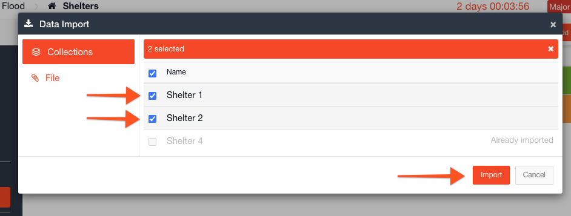
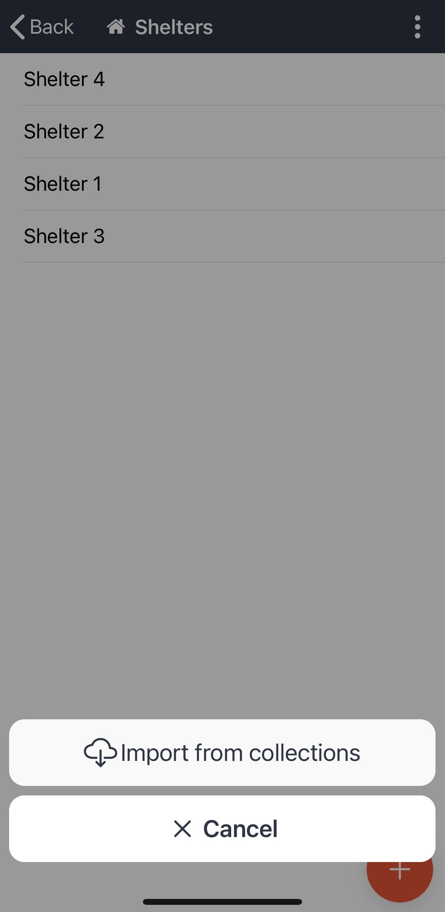
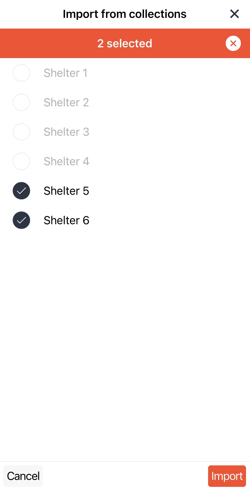

# Importing Collections into a Channel

#### WEB APP

Within [Incident Management](../../getting-started.md), it is possible to create and store pre-loaded content in [collections](./). Once you have created your collections in the [Admin Area](../), they become available to use within a [channel](../../channels/). 

It is now possible to configure a status board or task board to always suggest adding items from collections rather than adding a blank item. View [this](suggest-from-collections-versus-always-create-a-blank-item.md) article to see how to set this up.   
  
To import data from collections:

* Go to your open channel and go to a module you have pre-loaded with data
* Click on the **More Options Menu ⋮** next to the add button
* Select **Import**

* Check the box next to the items you wish to import from collections
* Click **Import**

* Once data has been imported from collections, there will be a message displayed saying **Already Imported** the next time you click on import

## Importing Personnel and Roles from Collections

When adding [Personnel](../../personnel/) and [Roles](../../roles/) to a channel, it will now always suggest from collections when you click the **Add** button. You will still have the option to **Add Blank**. 

**MOBILE APP**

It is now possible to import from collections in the mobile app. 

* Click the **More Options Menu :** and select **Import from collections**

\*\*\*\*

* Check the box next to the items you wish to import
* Click **Import**

\*\*\*\*

