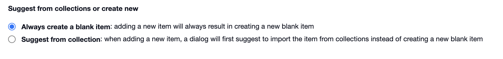

# Importing Collections into a Channel

#### WEB APP

Within [Incident Management](../../getting-started.md), it is possible to create and store pre-loaded content in [collections](./). Once you have created your collections in the [Admin Area](../), they become available to use within a [channel](../../channels/).   
  
To import data from collections:

* Go to your open channel and go to a module you have pre-loaded with data
* Click on the **More Options Menu ⋮** next to the add button
* Select **Import**

* Check the box to select the items you wish to import from collections
* Click **Import**

* Once data has been imported from collections, there will be a message displayed saying **Already Imported** the next time you click on import

## Suggest from Collections versus Always create a blank item

It is now possible to configure a status board or task board to always suggest adding items from collections rather than adding a blank item. To do this follow the steps below:

* Go to the **Admin Area** &gt; **Templates** &gt; **Status Boards** \(or **Tasks**\)
* Click **Edit** on the board you wish to preset this functionality on
* Click the radio button for **Suggest from collection**
* Click **Save** at the bottom of the page
* This status board will now always suggest to import items from collections when adding to it

* Go to the status board in your open channel
* Click **+Add** and select the items you wish to import
* Click **Import** to load the items into your status board

* You will still have the option to add a blank item if it does not exist in collections
* Simply select **Add blank** and you can enter the details as you normally would

* For some modules, you will always need to add a blank item. For this functionality check the radio button for **Always create a blank item**

## Importing Personnel and Roles from Collections

When adding [Personnel](../../personnel/) and [Roles](../../roles/) to a channel, it will now always suggest from collections when you click the **Add** button. You will still have the option to **Add Blank**. 

