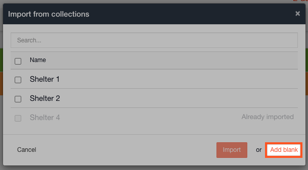

# Suggest from Collections versus Always create a blank item

You will have boards where you will mostly want to import from collections, e.g. hospitals, resources, personnel etc. and you will have boards where you will always want to create items from scratch e.g. casualties, damage reports, road blocks etc. 

It is now possible to configure a status board or task board to always suggest adding items from collections or to always add a blank item.

## Suggest from Collections

To configure a board to always suggest from collections follow the steps below:

* Go to the **Admin Area** &gt; **Templates** &gt; **Status Boards** \(or **Tasks**\)
* Click **Edit** on the board you wish to preset this functionality on
* Click the radio button for **Suggest from collection**
* Click **Save** at the bottom of the page
* This status board will now always suggest to import items from collections when adding to it

* Go to the status board in your open channel
* Click **+Add** and select the items you wish to import
* Click **Import** to load the items into your status board

* You will still have the option to add a blank item if it does not exist in collections
* Simply select **Add blank** and you can enter the details as you normally would

This feature also works when creating items from a [relationship field](../templates/form-builder-and-field-types/). You can now import multiple items at a time.

* Click into any relationship field on your board and you will see it lists already imported items which you can click on to select
* If the item you want to link has not yet been imported click **Add**
* Check the box next to the items you wish to link to this board
* Click **Import**
* These items are now linked in the relationship field and have also been imported into the channel

## Always create a blank item

To configure a board to always create a blank item follow the steps below:

* For some modules, you will always need to add a blank item. For this functionality check the radio button for **Always create a blank item**
* Go to the **Admin Area** &gt; **Templates** &gt; **Status Boards** \(or **Tasks**\)
* Click **Edit** on the board you wish to preset this functionality on
* Click the radio button for **Always create a blank item**
* Click **Save** at the bottom of the page
* This status board will now always create a blank item, allowing you to enter the details

## 

