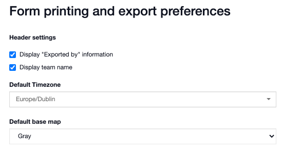
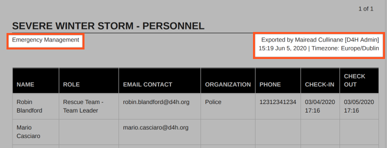

# Export Settings

#### WEB APP

You can choose what is included in the final channel export.  
  
Go to the [Admin Area](../)

* Open **Settings** &gt; **Export Settings**
* Choose the data you want on your PDFs and exports
* Click **Save** at the bottom of the screen

## Form printing and export preferences

Here you can choose to include the 'Exported by' information and team name on your exports and PDFs.   
  
This is also where you can set the default timezone on your account and default base [map](../../map/). 

## Data included in the channel archive

Here you can choose what data is included in the export from general information, built-in modules, and your custom modules. 

