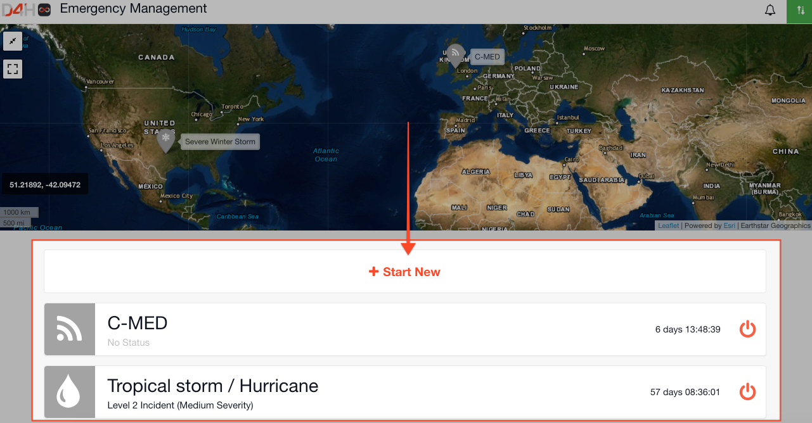

# Channels

Within Incident Management each event or incident is contained within a channel. A channel is an independent silo where you can work without affecting other channels.


It is now possible to assign a unique ref to your incidents










