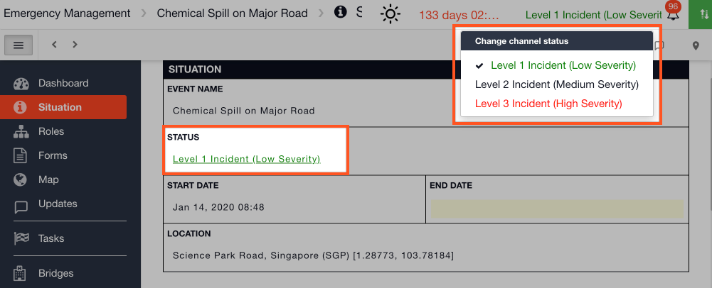
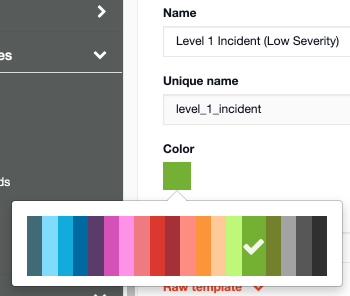
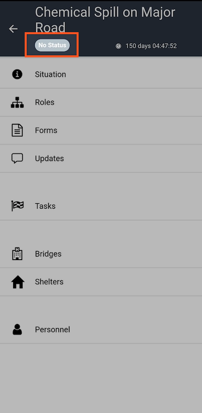
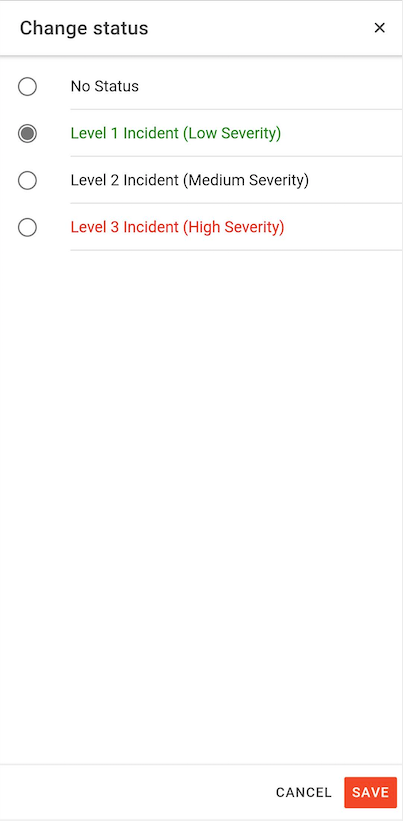

# Configuring the Channel Statuses

#### WEB APP

You can configure the Status field on your [Situation Report](../situation/) to list the statuses that you currently use when logging an incident / event.

* Go to the[ Admin Area](../admin-area/)
* Open Settings &gt; **Channel statuses**
* Click **New channel status**

## Name \(Required\)

This is the status name that will appear in the drop down field on the SITREP and it will appear in the top panel of the open incident / event.

## Unique name \(Required\)

The unique name is auto-generated.

## Setting a Color \(Optional\)

There are a set number of colours to choose from. The status will display in this colour font on your SITREP.

## Description \(Optional\)

You can add a brief description about the status. 


**Ideas for your Statuses:** 

* Alert
* Level-1 Emergency
* Level-2 Emergency
* Training Only
* EOC Level 1
* EOC Level 2
* EOC Level 3
* EOC Level 4
* Level 1 Hazmat
* Level 2 Hazmat
* Level 3 Hazmat 




#### MOBILE APP

* To change the channel status in the mobile app click on **No Status** 

* Choose the status from your configured statuses and click **Save** 

