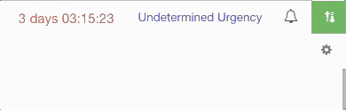

# Offline Capability

Our [Incident Management](../getting-started.md) platform is accessible from any internet connected device and data synchronized remains accessible and operational on off-line mode for times of limited connectivity.   
  
Connectivity is indicated on the top right hand side of the screen. When fully connected to our server you will see a green data transfer icon. When offline, you will see a red offline icon.

While offline, you can continue to access and update data within the channel.  
  
Any changes made will automatically be updated across the channel and visible to all personnel once you transition back to online mode.

## Offline Data Storage

There is no fixed limit on the amount of data you can store on your device when in offline mode however this will depend on the available space on the device.  
  
The data will be kept offline, granted that you don't clear the browser's cache, logout or re-sync the data while offline.  
  
Also when offline you must also take into account potential data conflicts, and the longer you remain offline the less likely it will sync correctly. We recommend offline mode is used for intermittent internet connections.  
  
Any template changes by other users that occur while you are offline may cause the offline data you have to be corrupted if it cannot sync straight away.

## FAQ

**Can I start a channel while offline?**  
You must be online to start a channel and access it for the first time.

**Can I host D4H Incident Management on my own local server?**  
No, it is a cloud hosted service.  
  
**What if two people update the same data field while offline?**  
We will always display the most recent data change \(not most recently sync'd\) however you can view all changes to a data field from the [Log](../situation/viewing-the-audit-trail.md).

