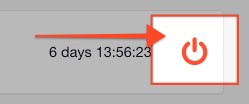

# Shutting Down a Channel

At the end of an event or incident you will 'Shutdown' a channel by pressing the power button on it.

#### WEB APP

This will open a dialog screen with a prompt to select an option:

1. **Create a new activity report** - This will create a draft activity in our [Incident Reporting](../../incident-reporting/getting-started.md) product. If you have syncing between Incident Management and Incident Reporting set up, this will be the only option available to you. 
2. **Generate a downloadable archive** - This will create a single .zip file for you to download to your local computer or store on your corporate network before deleting the original \(see Export Settings\).
3. **Delete data, do not save** - If you were only testing and do not want a copy retained.
4. **Decide later** - We'll move it to the archived section of the list. 

#### MOBILE APP

At present, it is not possible to shut-down a channel in the mobile app.  
  

