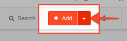

# Creating Collections

#### WEB APP

[Collections](./) allow you to create and store pre-loaded content for use during an event or incident. Before being available to use within a [Channel](../channels/), first you need to create some collections.

Within your [Incident Management](../getting-started.md) account go to the [Admin Area](../admin-area.md) and follow the steps below.

* Go to **Collections**
* Click on the module you want to pre-load data into \(this will be a [Form](../forms/), [Status Board](../status-boards/) or [Task Board](../task-boards.md) you have already created\)
* Click **Add**
* Fill in the details for your item.
* Add as many items as you would like to pre-load available in all channels.

When you go back to your open channel and go to that module, click on the small drop down arrow beside **Add**.

Your collection data will now be available to import into your channel.




You can pre-load all of your organization's data into collections so it is available every time without re-entering it.

For example, pre-load data about your organization:

* Checklists
* Tasks
* Shelters
* Roads
* Rivers
* Buildings
* Fleet


