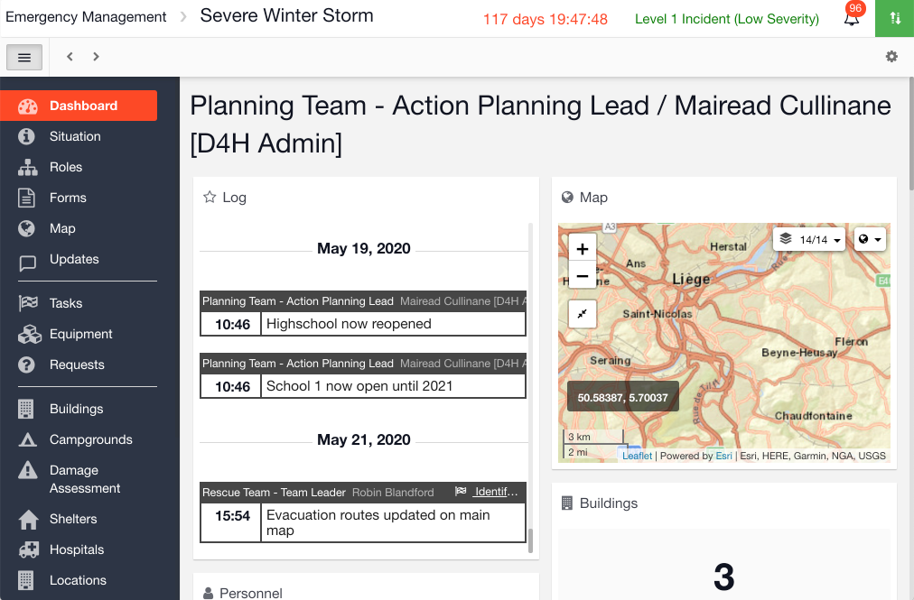

# Dashboard

#### WEB APP

The dashboard provides an at-a-glance view of key information relating to the event / incident in your [Incident Management](../getting-started.md) account. You can configure your dashboard to display the information you want to see from the modules within a [channel](../channels/). 

