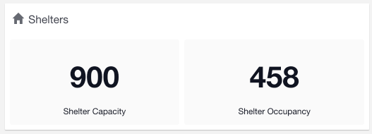
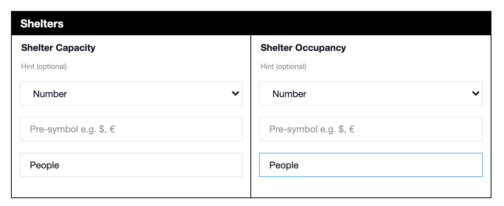
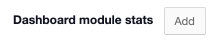
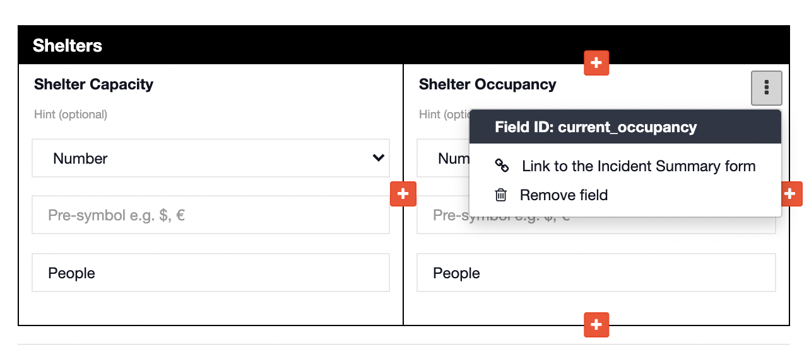
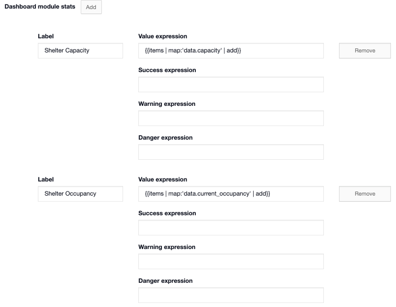

# Dashboard Module Stats

#### WEB APP

Dashboard module stats allow you to display the summed value of number fields from a [status board](../status-boards/) on the [dashboard](./). 



To do this go to the [Admin Area](../admin-area/) and follow the steps below:

* Open up Templates and click edit on the status board you wish to edit
* As this only works with number fields you must have a number field on your status board template



* Scroll to the bottom of the page and click ➕ **Advanced Options**
* Here you will see **Dashboard module stats**



* Click **Add**
* In this example I want to display the summed value for both **Shelter Capacity** and **Shelter Occupancy** on the dashboard
* You must use the field names to do this, the field name for **Shelter Capacity** is **capacity** and the field name for **Shelter Occupancy** is **current\_occupancy**. Click the three dots in the top right of the field to view the name, referred to as the Field ID.  



* To sum the total number for **Shelter Capacity** and display it on the dashboard, enter the following in **Value expression**: 

```text
{{items | map:'data.capacity' | add}}
```

* Click **Add** 
* To sum the total number for **Shelter Occupancy** and display it on the dashboard, enter the following in **Value expression**: 

```text
{{items | map:'data.current_occupancy' | add}}
```

* This is what it should look like in your account. Whatever you enter in the **Label** box will appear as the label on the dashboard



* Click **save** 

