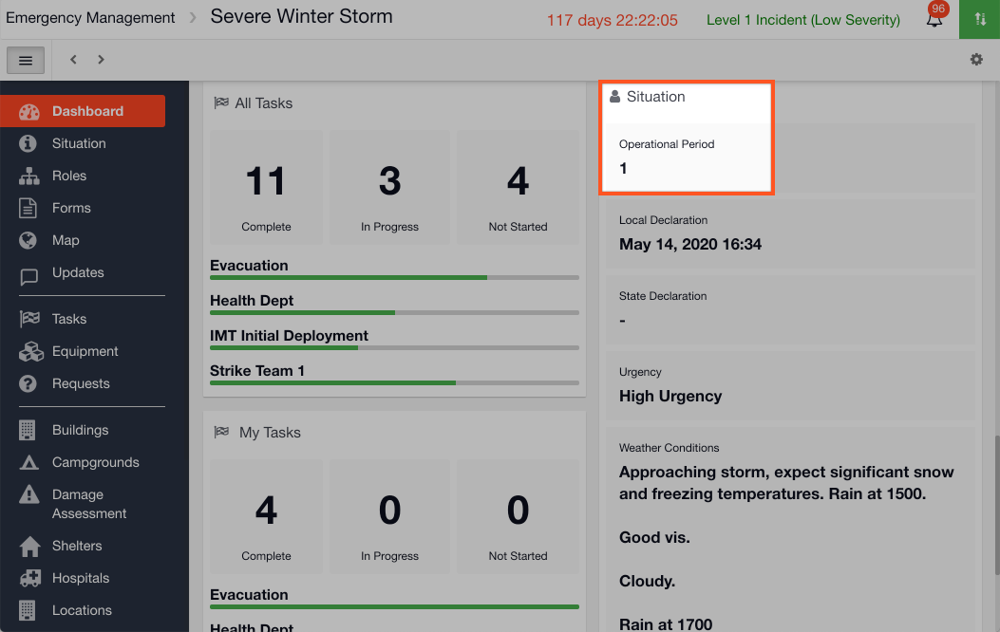
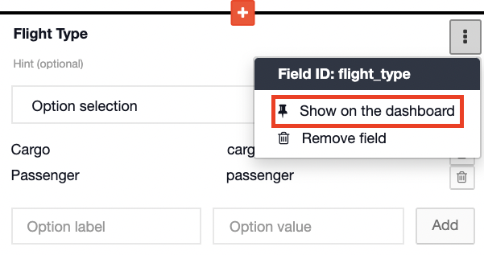

# Pinning a field to the Dashboard

#### WEB APP

You can pin any field from the [Situation ](../situation/)to the [Dashboard](./). To do this:

* Go to the [Admin Area ](../admin-area/)and Templates
* Open the Situation template
* Hover your mouse over the field you wish to pin and further options will appear on the right hand side of the field
* Click on the pin  symbol
* It will now say  This field will be shown on the dashboard 

