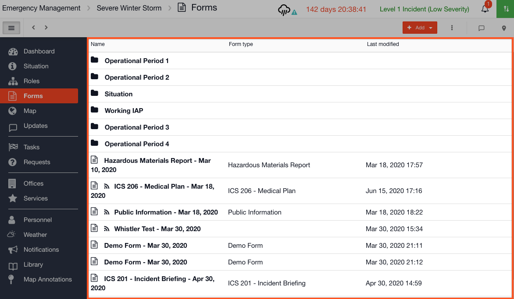

# Forms

In your [Incident Management](../getting-started.md) account you can create forms. These could include ICS forms, meeting schedules, action plans, executive summaries etc.   


Ideas for your Forms:

* ICS 205 Radio Comms
* Injury Report
* Hazardous Exposure Form
* Action Plan
* Public Information
* Cover Page
* Aircraft Data
* Damage Assessment Report
* Status Report
* EMT Meeting Agenda


## Templates

Each form has a [Template](../templates/) which outlines its layout.







## Collections

[Collections](../collections/) are used to pre-load data into a Form. For example you might have a Meeting Schedule and you could enter all the unchanging details into the collections in advance. They are then available pre-loaded to import during an Incident.  







## Using Forms

When you come to use a Form during an event you should first add it to your channel, or start your channel with a [Play](https://support.d4h.org/incident-management-admin-area/plays) that includes it.













