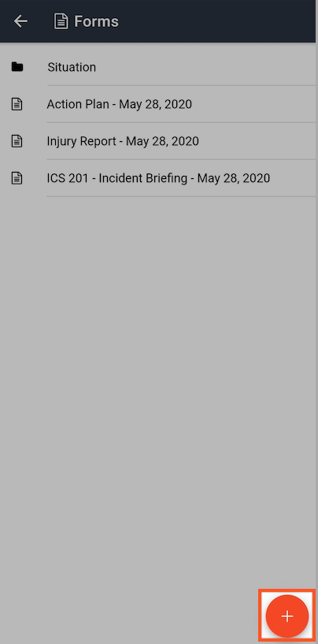
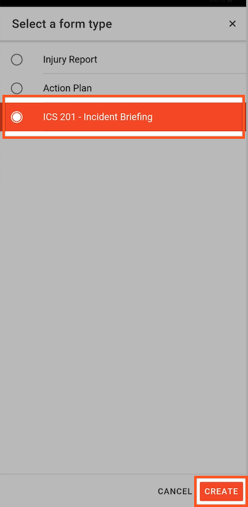

# Adding a Form to a Channel

#### WEB APP

Once you have created your [form templates](../admin-area/templates/form-builder-and-field-types/) in the [Admin Area](../admin-area/) you will want to add them to an open channel. You can also add them to [Collections](../admin-area/collections/) and include them in a [Play](../plays/).  
  
Go to Forms in an open channel

* Click on the orange **Add** button
* Select the form you wish to add to the event / incident 

#### 

#### MOBILE APP  

