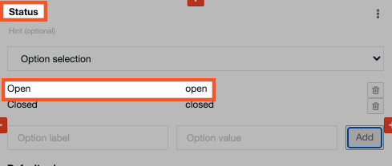
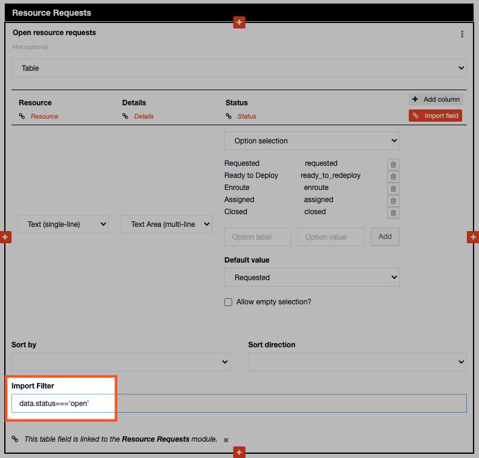

# Using the Import Filter linked to a Status Board

For example you might have a [status board](../../../status-boards/) for Resource Requests and want to see all open resource requests in a table on your [situation report](../../../situation/).   
  
You would need to take the field name from the 'Status' field that you have added to the status board.

* Open the relevant status board
* Find the 'status' field you added to your status board
* Locate the field name which will always be in lower case
* Copy the field name, in this case it is open 



* Next, go back to your situation template
* Locate the table field and enter the code below in the import filter box:

```text
data.status==='open'
```

This is how it will appear on the table field on your Situation Report in the Admin Area:



* This will add only the resource requests that are open to the table 

