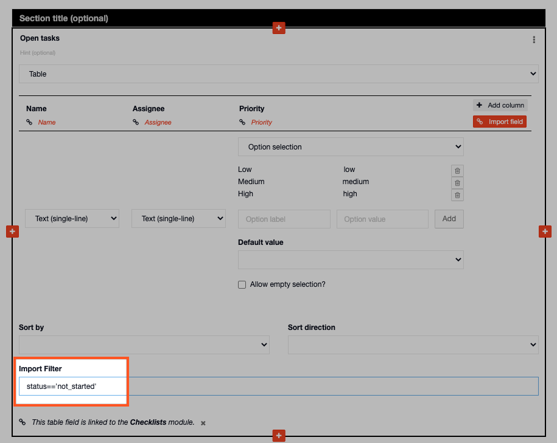
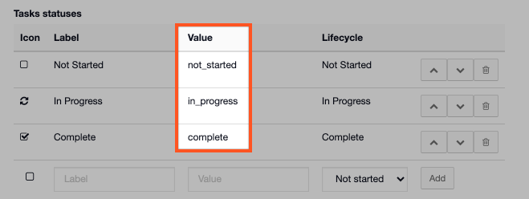

# Using the Import Filter linked to a Taskboard

For example you may want to add a table to your [Situation Report](../../../situation/) that shows all tasks that have not yet started. This would require you to enter the following code into the import filter box on the table field:

```text
status==='not_started'
```

  
This is how it will appear on the table field on your Situation Report in the Admin Area:




'not\_started' is taken from the task statuses value on the taskboard. If you have edited these you will need to take the value from your new task statuses. 





