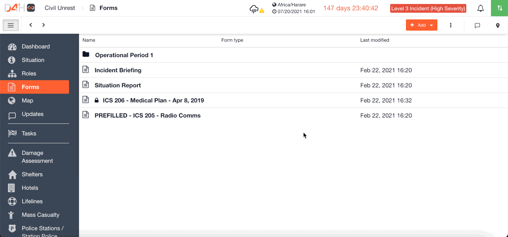

# Sorting Forms Alphabetically

Once you have added some [forms](./) to your channel in [Incident Management](../getting-started.md), you can choose how you want to sort them. Your options are date created, date modified, or alphabetically.  
  
To sort your forms alphabetically

* Click on **More Options \[⋮\]**
* Click on **Sort By**
* Chose **Name** and then select either **Ascending** or **Descending** 

