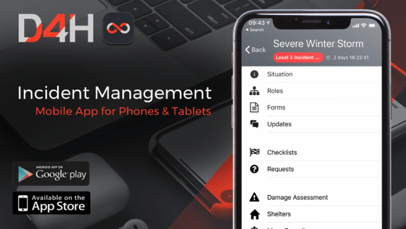

# Incident Management App

Use the Incident Management mobile app to manage your resources.  Remotely assign roles, view and update the situation, fill out forms, and complete tasks. Any changes made in the app will appear live on all other platforms as long as you are connected to the internet. All D4H apps allow for the use of [biometric authentication](../shared-services/biometric-authentication.md) to secure your data.

After logging into the app, a page will appear displaying all of the ongoing incidents. Click into one to view the following sections:

## Situation

The [Situation ](situation/)provides the latest updates on an event / incident. Depending on your [permission profile](../user-access/permissions.md), you can click on the fields to make changes to the situation report. 

## Roles

Assign [personnel ](personnel/)to existing [roles](roles/) in the app by clicking on a role then filling out the Assigned Personnel field. Clicking into a role will also allow you to fill out custom fields that have been added in advance to capture additional information about roles. See below for instructions on how to create a new role within the app. 

## Forms

Complete existing[ forms](forms/) in the app by clicking on the forms and then selecting fields to add to. Add new forms by clicking the **+** in the bottom right and selecting a form type from the list of [templates](admin-area/templates/).

## Updates

View and post [updates](updates/) in this section. Attach images and videos to messages to share with other team members. 

## Task Boards

  
Status Boards  
Personnel  
Library  

## Creating New Roles

To add new roles within the app:

* Click the **+** in the lower right corner
* Chose role from the options presented
* Select what team you want the role to be under
* Specify the title of the role by clicking on the name field
* Fill out any other information you want related to the role in the other fields
* Click back to return to the main roles page 

## Completing a Task List

To complete a task list within the app: 

* Select the task board your list is in
* Select the list itself
* Click on a task to view more information about it
* To mark a task a complete, click the square box icon to the left of the task and select Complete

