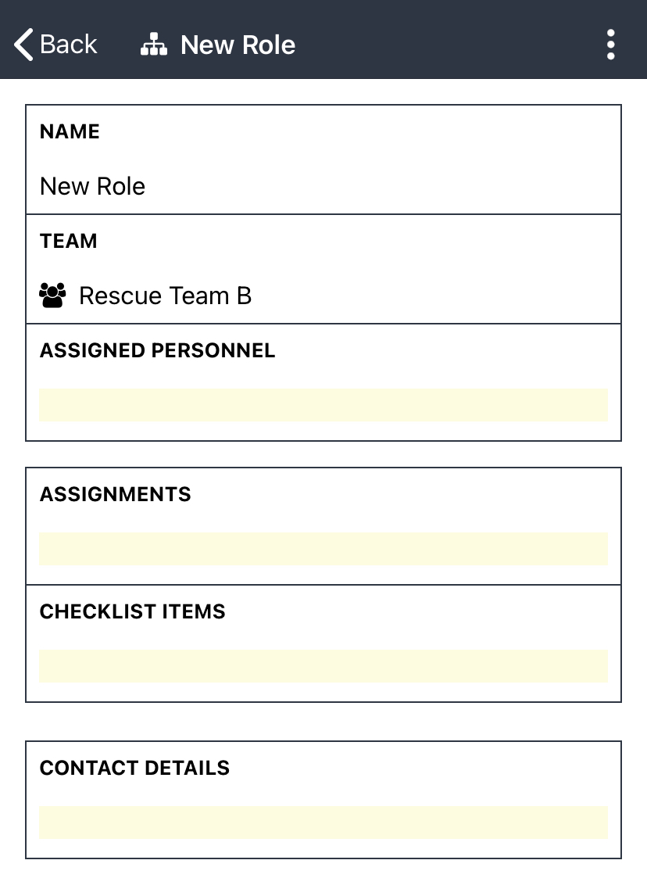

# Creating New Roles in the App

To add new roles within the [D4H Incident Management ](../getting-started.md)app:

* Click the **+** in the lower right corner
* Chose **role** from the options presented
* Select what team you want the role to be under
* Specify the title of the role by clicking on the name field
* Fill out any other information you want related to the role in the other fields
* Click back to return to the main roles page 

