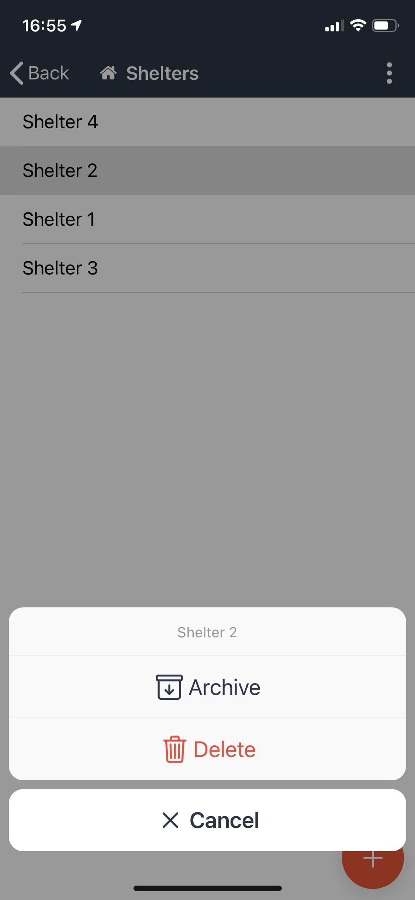

# Long Tap to Show Available Actions in App

Use a Long Tap in the [D4H Incident Management ](../getting-started.md)App to show available actions for items within [status boards](../status-boards/), [personnel lists](../personnel/), [roles](../roles/), and [tasks](../task-boards/). To use this feature:

* Open up a list of items
* Press down on one item and hold for one to two seconds
* Select one of the options that appears

