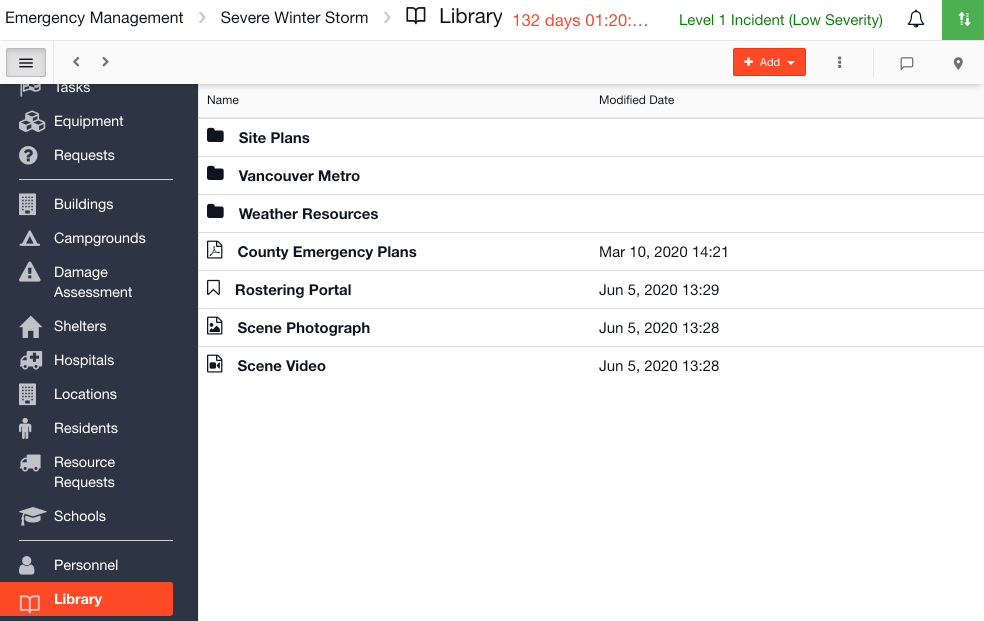

# Library

The Library is where you can store files and links to websites. It is a place to store resources that you normally use during an event / incident.

## Collections

[Collections](../admin-area/collections/) are used to pre-load data into the Library. For example you might want to upload your Site Plans or EOC SOP forms. They are then available pre-loaded to import during an incident. You could also pre-load documentation that you want your members to read on an event / incident, such as Incident Planning Guides. 







## Using the Library







