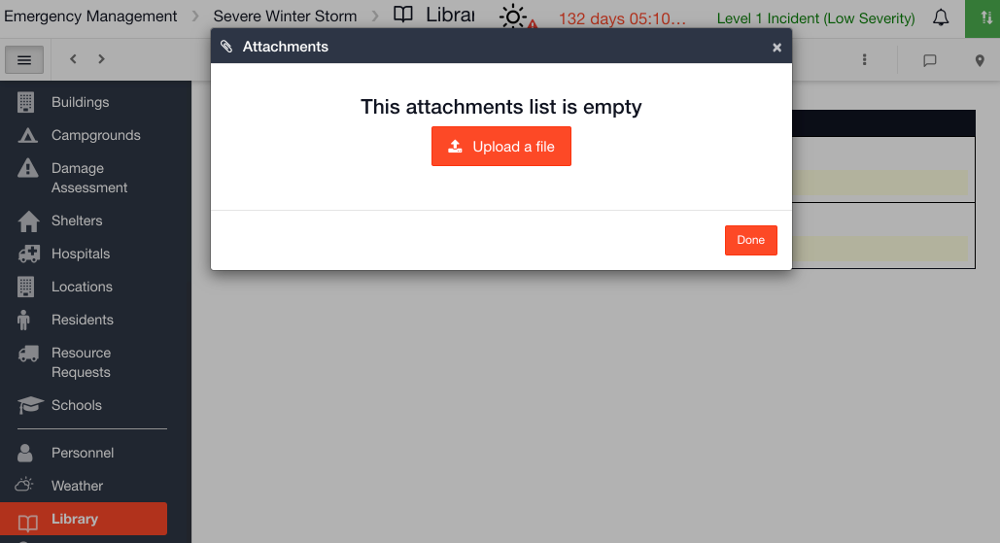

# Adding a New File

#### WEB APP

To add a new file to your [Library](./) follow the steps below. 

* Click on **Add**
* Select  **New File**
* Give your document a name
* Click in the File field and a box will pop up
* Here you can upload any file from your PC
* Select  **Upload a file** and choose a file
* Click **Done** 

#### MOBILE APP

* Click on the red + icon and select the  file icon
* You can upload an existing file on your phone or an image from your camera's gallery or take a picture to upload
* To create a new folder click on the red + icon and select the  folder icon
* To delete a file, hold down on the file with your finger and an action menu will appear at the bottom of the screen allowing you to delete or edit the file

