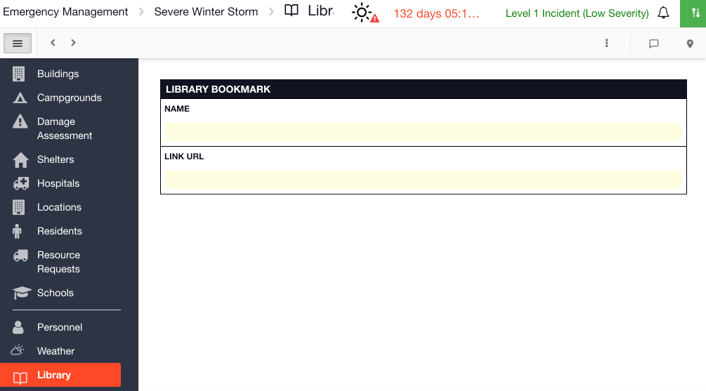
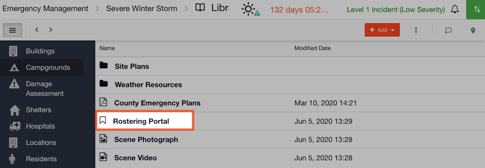

# Adding a New Link

#### WEB APP

To add a new link to your [Library ](./)follow the steps below.

* Click on **Add**
* Select**New Link**
* Give your document a name
* Click in the Link URL field and paste the URL you wish to add 

* Now when you go back to your list of documents in the Library, your new link will be saved here
* When you double click on it, it will open the URL in a new tab 

#### MOBILE APP

* Click on the red + icon and select the link icon
* Here you can paste in the link URL
* To create a new folder click on the red + icon and select the  folder icon
* To delete a link, hold down on the link with your finger and an action menu will appear at the bottom of the screen allowing you to delete or edit the link

