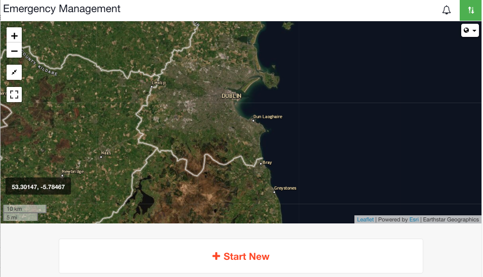

# Map

This is an image of the map on the channels list page. You can set the map view for this screen in Preferences in the [Admin Area](../admin-area/).

  
When you start a new [channel](../channels/), the first thing you will start filling out is the Situation Report. The location set on the [Situation](../situation/) will be pinned to the map. All other location fields used throughout the channel, such as in [Tasks](../task-boards/) or on [Status Boards](../status-boards/), will also feed back to the main map. You are able to view satellite areas on the map and you can draw areas on the map using the set of drawing tools.

## Collections

[Collections](../admin-area/collections/) are used to pre-load Map layers into your account. They are then available to use in any channel. 







## Using Maps









