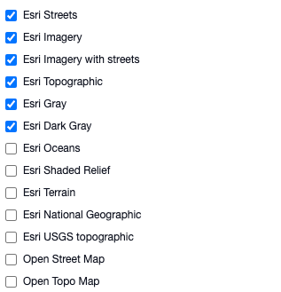

# Selecting basemaps to display

#### WEB APP

To select which basemaps to display:

* Click on the **green ⇅** in the top right hand corner.
* Go to **Admin Area**
* Navigate to **Settings** &gt; **Preferences** on the left side bar.
* Scroll down to **Map** &gt; **Available Basemaps**

Here you can select which basemaps should be displayed in your account, or add your own custom basemaps.  
  

  
  

