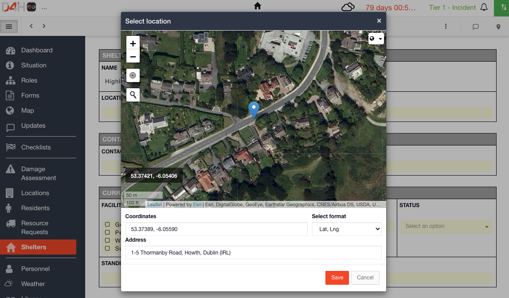
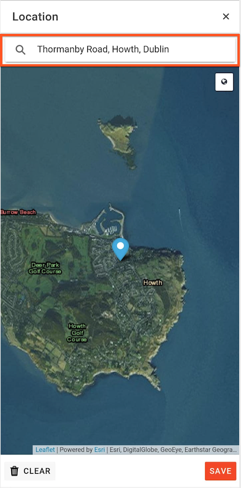

# Display a Status Board on the Map

You can display your status boards on the map which makes it easy to see the location spread of an event / incident in relation to the information within your different status boards.  
  
To display them on the [Map](./), you must have a [location field ](../admin-area/templates/form-builder-and-field-types/)on your [Status Board](../status-boards/) form 

* Click into the location field within a row
* Search for an address by clicking on the magnifying glass or by dragging and dropping the pin to the location
* Continue doing this for your other status boards
* When you click on the map icon  it will open the map on screen where you can see all pinned locations for your status boards
* Go to the Map module and you will see all pinned status board locations here too 

#### WEB APP

#### MOBILE APP 

