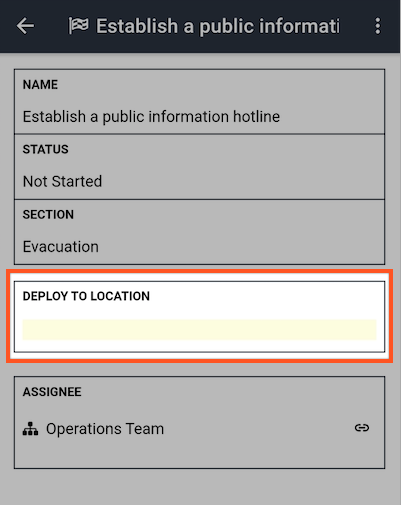
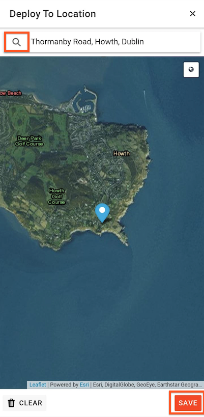

# Displaying Tasks on the Map

You can display your tasks on the map which makes it easy to see the location spread of tasks across an event / incident.

#### WEB APP

To display tasks on the [Map](./), you must have a [location field](../admin-area/templates/form-builder-and-field-types/) on your [Tasks](../task-boards/) form 

* Click into the location field on your task
* Search for an address by clicking on the magnifying glass or drag and drop the pin to the location
* Continue doing this for your other tasks
* When you click on the map icon  it will open the map on screen where you can see all pinned locations for your tasks
* Go to the Map module and you will see all pinned task locations here too



#### MOBILE APP

* Click into the location field on your task
* Search for an address by typing into the search box
* Click **Save** 

  
  

