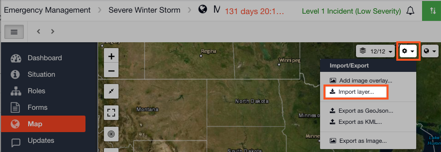

# Importing Map Layers into a Channel

#### WEB APP

Once you have [loaded map layers](loading-map-layers-in-collections.md) into [Collections](../admin-area/collections/) in the [Admin Area](../admin-area/), they become available to use within a channel. To import map layers into a channel

* Go to your open channel 
* Go to the [Map](./)
* Click on the gear cog  icon
* Select  Import layer

Your collection data will now be available to import into your channel.

