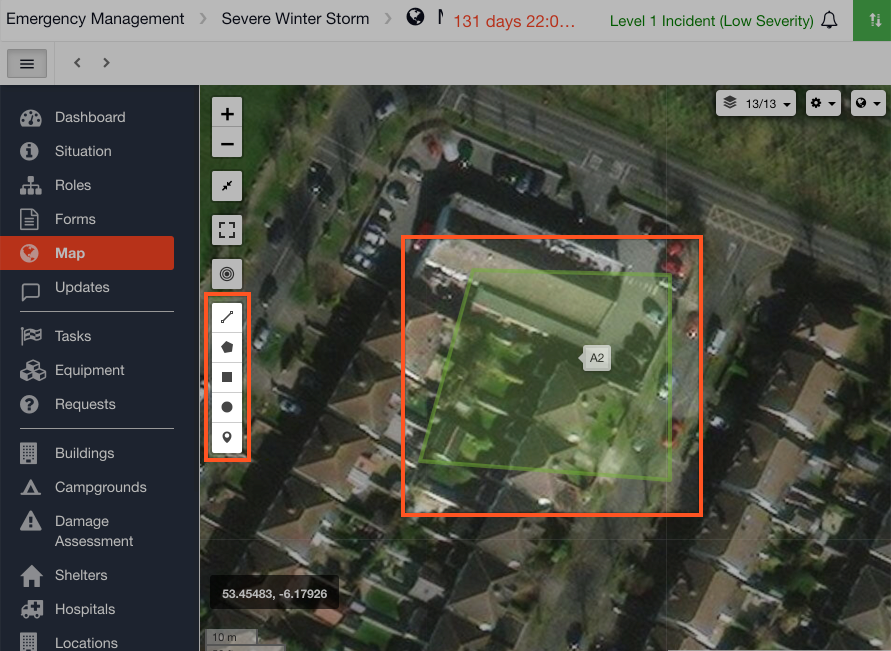
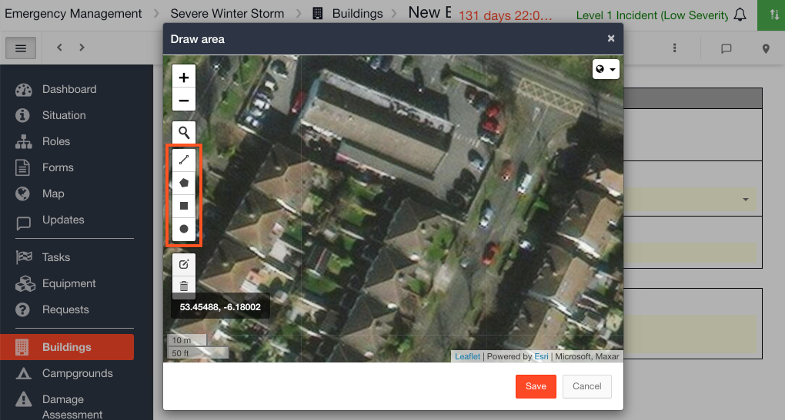

# Map drawing tools

You can use the drawing tools on the [map](./) to mark out an area of interest. You will find the drawing tools on the main map and on the map that pops up when you click into a location field. 

## Main Map

#### WEB APP

Drawing tools on the main map:

#### MOBILE APP

At present, the main map is not available in the mobile app.

## Location \(Map Feature\) Map

#### WEB APP

Drawing tools on the location \(map feature\) field:

#### MOBILE APP

  
To use the drawing tools follow the steps below.

* Select the shape you wish to use to mark out an area on your map
* Click and drag your mouse on the map to create the shape
* Click **Add**
* Name the map annotation and choose a color
* To edit the map annotation, click on it and a menu will appear allowing you to either edit or delete the drawing


The following are examples of what you can use the drawing tools to mark on the map: 

* An area of flooding
* An evacuation area
* Pin a Last Known Point
* An area that has been destroyed
* Pin a Staging Area
* Mark a road / rail line that is closed


  

