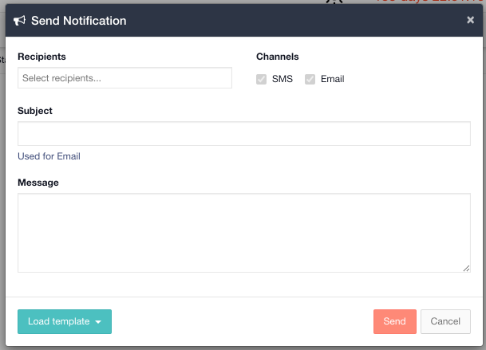

# Mass Notifications

### Mass Notifications

You can [connect a mass notifications provider](adding-mass-notification-providers.md) which will allow you to broadcast messages from your [Channel](https://support.d4h.org/d4h-incident-management/channels) to the address book groups in the provider. 







## Sending a New Message through Mass Notifications

  
Follow the instructions below to send a new message through our Mass Notifications module.

* In an open channel go to the Notifications module on the left hand menu
* Click Send Notification
* Choose the recipients you wish to send the message to
* Enter a subject line and message for the SMS / Email or choose a template
* Click **Send** 

#### WEB APP 

#### MOBILE APP

At present, mass notifications is not available in the mobile app.

