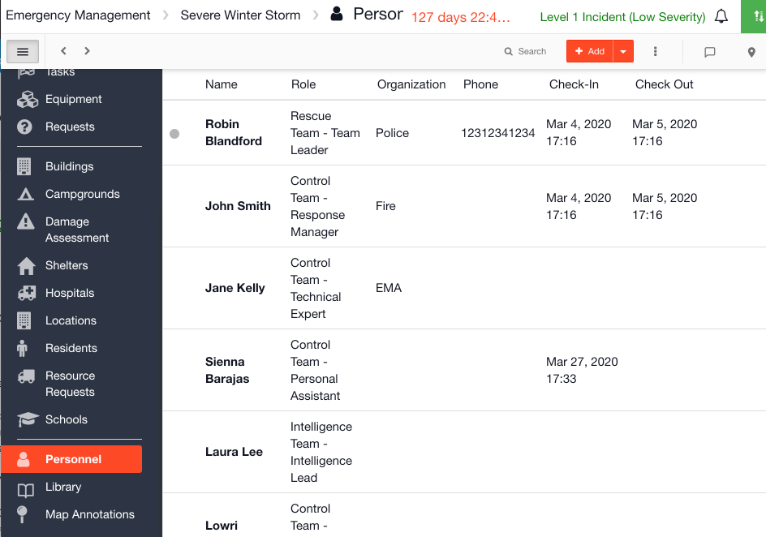

# Personnel

The Personnel module in your [Incident Management](../getting-started.md) account is where you will see a list of all your personnel who have access to that channel. You can see who is currently online from this screen. Anyone who is online will have a  green dot next to their name and anyone who is offline will have a  grey dot.

\
You can also assign a role to a member during an event / incident from this screen.&#x20;

## Templates

Personnel have a [Template](../admin-area/templates/) which outlines the layout of the form behind it, and which columns should display on the [list view](../admin-area/templates/list-layout-columns.md). There is only one Personnel template for all of your channels across your Incident Management account.&#x20;


[configuring-the-personnel-template.md](configuring-the-personnel-template.md)



[form-builder-and-field-types](../admin-area/templates/form-builder-and-field-types/)



[list-layout-columns.md](../admin-area/templates/list-layout-columns.md)



[show-or-hide-a-form-section-based-on-the-value-of-a-field-option.md](../admin-area/templates/form-builder-and-field-types/show-or-hide-a-form-section-based-on-the-value-of-a-field-option.md)


## Collections

[Collections](../admin-area/collections/) are used to pre-load data into the Personnel module. This is where you will add your personnel to create their D4H Incident Management account and assign them a permission profile.&#x20;


[creating-collections.md](../admin-area/collections/creating-collections.md)



[adding-personnel-in-collections.md](adding-personnel-in-collections.md)



[importing-collections-into-a-channel.md](../admin-area/collections/importing-collections-into-a-channel.md)



[including-collections-in-a-play.md](../plays/including-collections-in-a-play.md)


## Using Personnel

When you open a new [channel](../channels/) you can add in teams and roles on the fly or you can import them from collections.  Or you could start your channel with a [Play](../plays/) that includes the teams and roles required for that type of incident / event.


[assigning-a-permission-profile.md](assigning-a-permission-profile.md)



[tagging-one-of-your-personnel-in-the-log.md](../updates/tagging-one-of-your-personnel-in-the-log.md)



[searching-personnel.md](searching-personnel.md)



[sorting-personnel.md](sorting-personnel.md)



[printing-to-pdf.md](../situation/printing-to-pdf.md)



[viewing-the-audit-trail.md](../situation/viewing-the-audit-trail.md)

