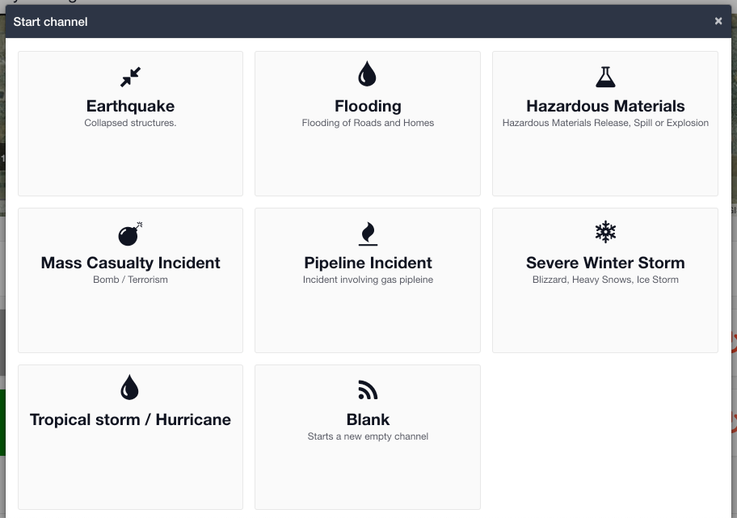

# Plays

#### WEB APP

Within[ Incident Management](../getting-started.md), Plays are the automations that run when a [channel](../channels/) is started.

You can configure your play to automatically add modules such as [Task Boards](../task-boards/) and [Status Boards](../status-boards/) to your channel when you start it. You can also build out data in [collections ](../admin-area/collections/)and choose what you want available in a play by selecting those items. 

You can create as many plays as you need. You will also have the option to start a blank play if what you are looking for does not exist when opening a new incident. Here's some examples you could create in your account


**Ideas for your Plays:**

Here are some ideas from other customers to get you started.

* Wildfire
  * you might want to turn on your Damage Assessment status board, Initial Response task board, and the Weather\

* Missing Person Search
  * you may want to turn on the Weather, your Clues status board, and Rescue Checklist task board, you can also choose what task lists you want available\

* Tornado
  * you may want to turn on your Damage and Accommodation status boards. You might also want the Weather and Library Documents turned on\

*   Pandemic

    * you could turn on Forms and include an Incident Briefing form. You may also want your Ambulance Services and Person(s) Under Investigation status boards turned on

* Evacuation
  * you might want to switch on your Buildings status board, add an Evacuation task list and an Evacuation Officer role. You may also want the Weather for this type of incident\

* Transportation Incident
  * you could turn on your Facilities and Media Statements status boards \

* Chemical Spill
  * you might want to turn on your Facilities status board and include your Hospitals B & C from collections\

* Hospital Universal Incident
  * you could turn on forms and include your Quick Start IAP from collections, you may also want your Bed Availability and Ambulance Services status boards\

* Tropical Storm / Hurricane
  * you might want to turn on your Hospitals status board, Resource Requests task board, and the Weather module


## Admin Area

Each play will be configured in the [Admin Area](../admin-area/) to specify which modules should be turned on and what data from the collections should be available. 


[.](./)



[creating-a-new-play.md](creating-a-new-play.md)


## Collections

[Collections](../admin-area/collections/) are used to pre-load data into a Play. For example you might have a Play called 'Tropical Storm' and you could enter all the county storm shelters into the collections in advance. You can then add these collections and a [status board](../status-boards/) of 'Shelters' to your 'Tropical Storm' play and they will appear in the channel every time you start a 'Tropical Storm' play.


[creating-collections.md](../admin-area/collections/creating-collections.md)



[including-collections-in-a-play.md](including-collections-in-a-play.md)


