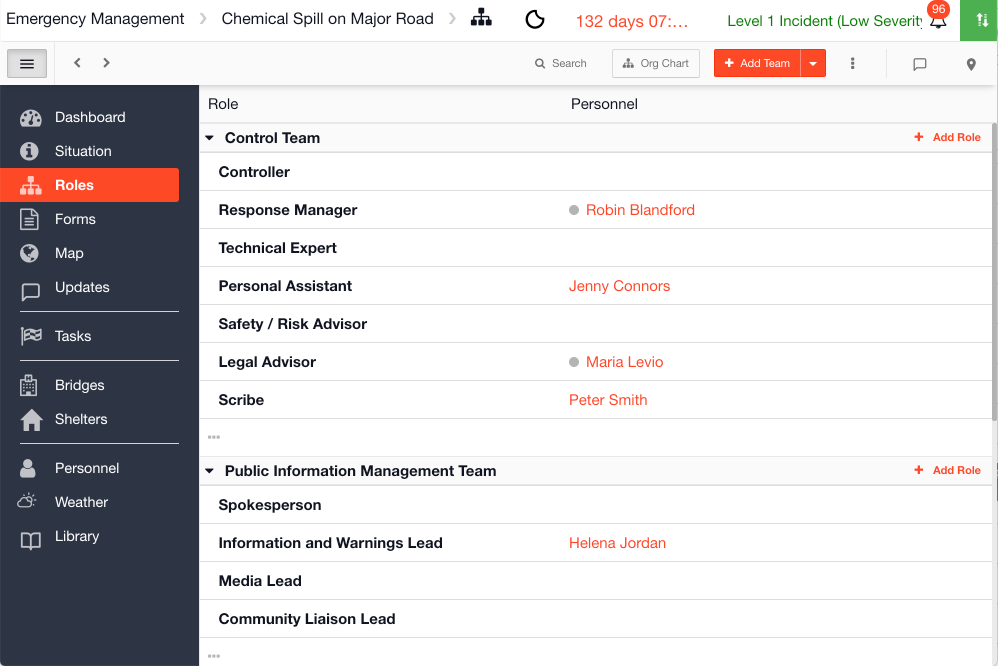

# Roles

The Roles module in your [Incident Management ](../getting-started.md)account is where you can assign a role to a member during an event / incident. 

You can customize the roles displayed in the channel based on the organizational structure of your team. Examples of roles include Incident Commander, Captain, Team Leader or Officer In Charge.

## Templates

Your roles have a [Template](../admin-area/templates/) which outlines the layout of the form behind each role, and which columns should display on the list view. There is only one Role template for all of your channels across your Incident Management account. 









## Collections

Collections are used to pre-load data into the Roles module. For example you might have a team called Operations Team and you could enter all the roles into the collections in advance. They are then available pre-loaded to import during an Incident. You can also have the roles pre-assigned in collections before importing them, if the same person will be in the same role for every incident. 







## Using Roles

When you open a new [channel](../channels/) you can add in teams and roles on the fly or you can import them from collections.  Or you could start your channel with a [Play](../plays/) that includes the teams and roles required for that type of incident / event.



















  

