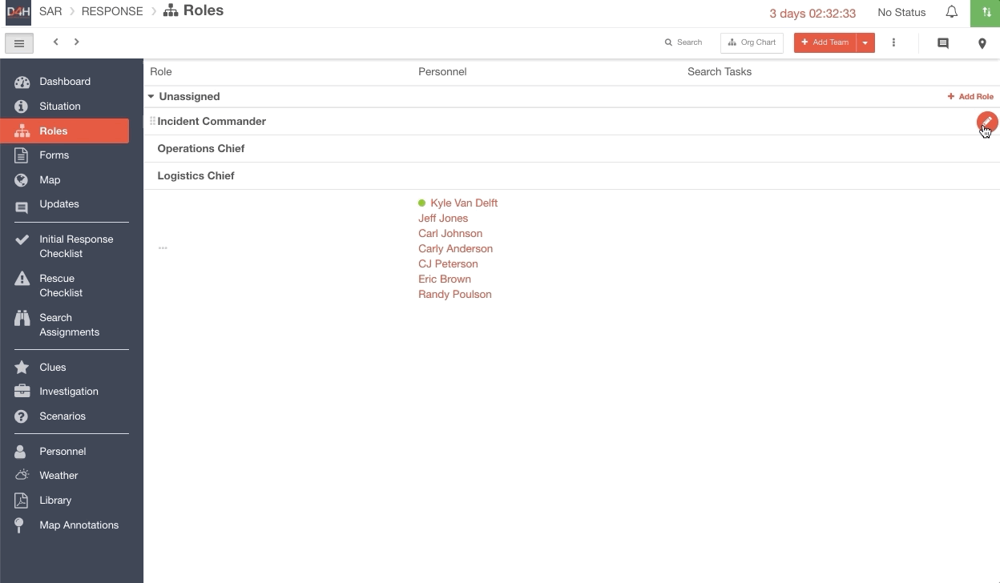
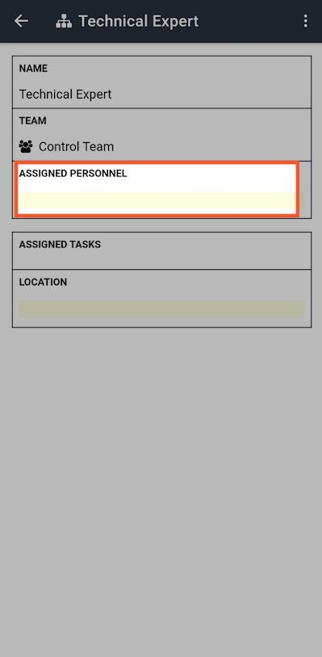
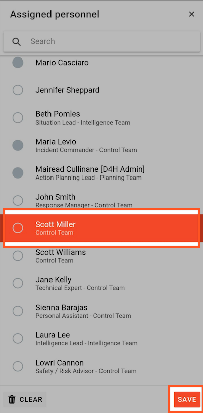

# Assigning a Role

To assign a role in your [Incident Management ](../getting-started.md)account, go to the  Roles module

* Locate the role you wish to assign
* Select the edit icon then select the person who will be assigned the role from the dropdown menu
* Select the checkmark icon to save

  
[Roles](../../personnel-and-training/roles/) can also be assigned from the [Personnel](../personnel.md) menu following similar instructions. Locate the person whom you wish to assign the role too, select the edit icon next to their name then select the role you wish to assign from the drop-down menu. Select the checkmark icon to save.  
  

#### WEB APP 

#### MOBILE APP 

  
 

