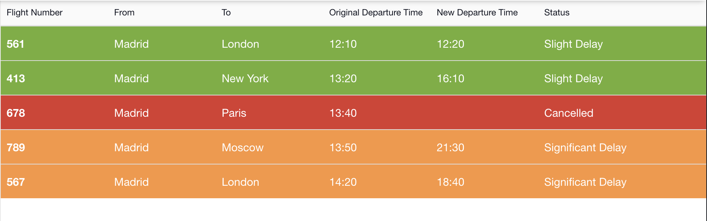
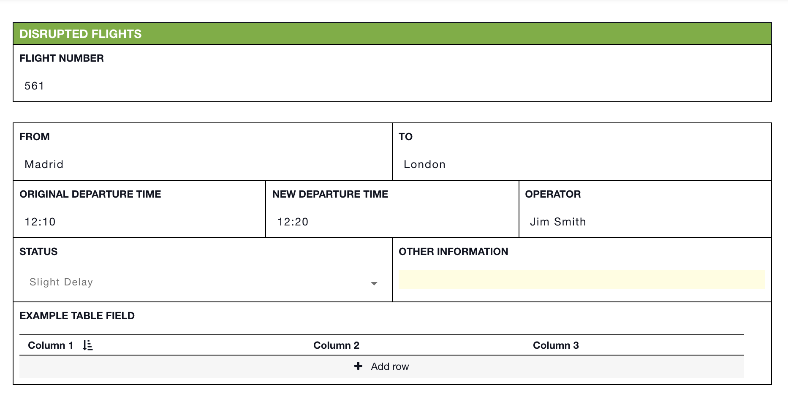

# Disrupted Flights


This article is part of [sample templates](../) for Incident Management


Use the disrupted flights status board to track the impact of the incident on air travel. Organize the flights by whether they are delayed slightly, significantly, or cancelled. The customizable form allows you to record any pertinent information your teams need to know and shares it with them in real time. An example table field has been built in for you to use as a starting point.   
  
To upload this template into your account, follow the steps on our [Importing Sample Templates](../importing-sample-templates.md) page.






 Copy the code below to add this template to your account


```text
{
  "name": "Disrupted Flights",
{
  "name": "Disrupted Flights",
  "defaultColor": null,
  "nameLabel": "Flight Number",
  "uniq_name": "disrupted_flights",
  "icon": "fa fa-plane",
  "quickAdd": true,
  "suggestFromCollections": false,
  "layout": [
    {
      "type": "section",
      "rows": [
        {
          "type": "row",
          "items": [
            "from",
            "to"
          ]
        },
        {
          "type": "row",
          "items": [
            "original_departure_time",
            "new_departure_time",
            "operator"
          ]
        },
        {
          "type": "row",
          "items": [
            "status",
            "other_information"
          ]
        },
        {
          "type": "row",
          "items": [
            "test_table_field"
          ]
        }
      ]
    }
  ],
  "fields": {
    "from": {
      "label": "From",
      "type": "text"
    },
    "to": {
      "label": "To",
      "type": "text"
    },
    "original_departure_time": {
      "label": "Original Departure Time",
      "type": "text"
    },
    "new_departure_time": {
      "label": "New Departure Time",
      "type": "text"
    },
    "status": {
      "label": "Status",
      "type": "select",
      "options": [
        {
          "label": "Slight Delay",
          "value": "slight_delay"
        },
        {
          "value": "significant_delay",
          "label": "Significant Delay"
        },
        {
          "value": "potentially_cancelled",
          "label": "Potentially Cancelled"
        },
        {
          "value": "cancelled",
          "label": "Cancelled"
        },
        {
          "value": "other",
          "label": "Other"
        }
      ],
      "default": null
    },
    "other_information": {
      "label": "Other Information",
      "type": "text"
    },
    "operator": {
      "label": "Operator",
      "type": "text"
    },
    "test_table_field": {
      "label": "Example Table Field",
      "type": "table",
      "fields": {
        "test": {
          "label": "Column 1",
          "type": "select",
          "options": [
            {
              "label": "y",
              "value": "y"
            },
            {
              "value": "n",
              "label": "n"
            }
          ],
          "default": null
        },
        "test_2": {
          "label": "Column 2",
          "type": "select",
          "options": [
            {
              "label": "y",
              "value": "y"
            },
            {
              "value": "n",
              "label": "n"
            }
          ],
          "default": null
        },
        "test_3": {
          "label": "Column 3",
          "type": "select",
          "options": [
            {
              "label": "y",
              "value": "y"
            },
            {
              "value": "n",
              "label": "n"
            }
          ],
          "default": null
        }
      },
      "layout": {
        "columns": [
          "test",
          "test_2",
          "test_3"
        ]
      }
    }
  },
  "expressions": {
    "success": "status===\"slight_delay\"",
    "warning": "status===\"significant_delay\" || status===\"potentially_cancelled\"",
    "danger": "status===\"cancelled\""
  },
  "listLayout": {
    "row": [
      "from",
      "to",
      "original_departure_time",
      "new_departure_time",
      "status"
    ]
  },
  "defaultSortingProperty": "created_date",
  "defaultSortingOrder": "asc",
  "defaultShowOwnItemsOnly": false,
  "defaultShowArchived": false
}
```

